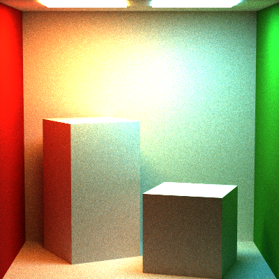
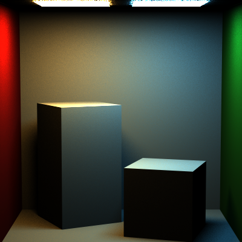
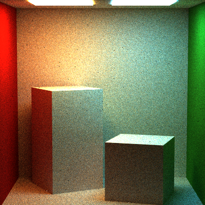
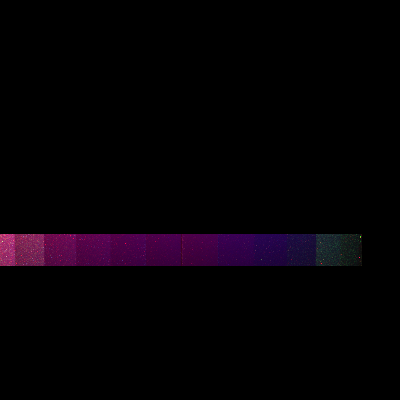
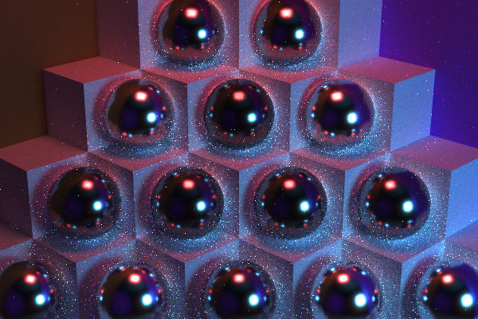
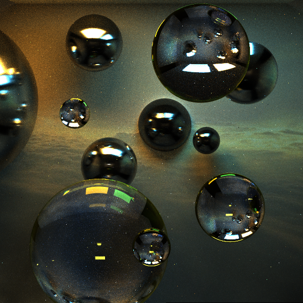
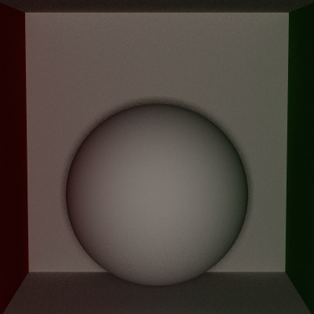
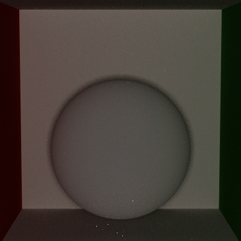
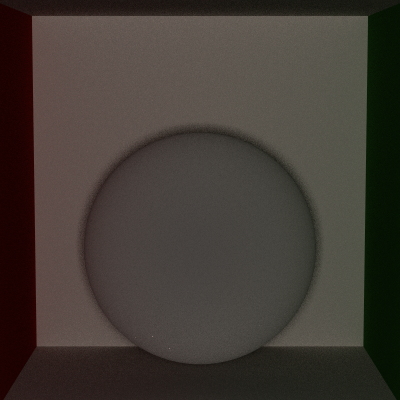

Path Tracer Episode V: Global Illumination Strikes Back
======================
All images are rendered with 900 samples per pixel and a recursion depth of 8

Sarah Forcier
58131867

Comparison
------------
#### New Full Lighting

#### Old Full Lighting

#### Direct Lighting

#### Naive

Custom scenes
-----------
####Bubbles
Description

####Stairs
description

####Curved Wall

Extra credit
-----------
####Oren Nayar (5)
all rendered with 100 samples, 5 recursion, full lighting

Lambertian

 

Sigma = 0.3

 

Sigma = 0.5

####Lambertian Transmission (5)

####Fresnel Conductor (8)
