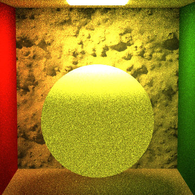

Path Tracer Episode V: Global Illumination Strikes Back
======================

Sarah Forcier
58131867

Comparison
------------
Images rendered with 900 samples per pixel and a recursion depth of 8
#### New Full Lighting

#### Old Full Lighting

#### Direct Lighting

#### Naive

Custom scenes
-----------
Images rendered with 1600 samples per pixel and a recursion depth of 8
#### Bubbles
Scene Description: plastic bubble material, three multi colored lights

#### Spheres on Stairs
Scene Description: mirrored microfaceted spheres, staircase is a mesh modeled in maya with a matte material, two lights

#### Spheres in the Sky
Scene Description: gold metal and glass spheres in a environment cube, three lights

Extra credit
-----------
#### Oren Nayar (5): rendered with 100 samples, 5 recursion, full lighting

Lambertian

 

Sigma = 0.3

 

Sigma = 0.5

#### Lambertian Transmission (5)

#### Fresnel Conductor (8)
The gold metal in an above image uses a Fresnel Conductor where k and eta are constants given in PBRT. 