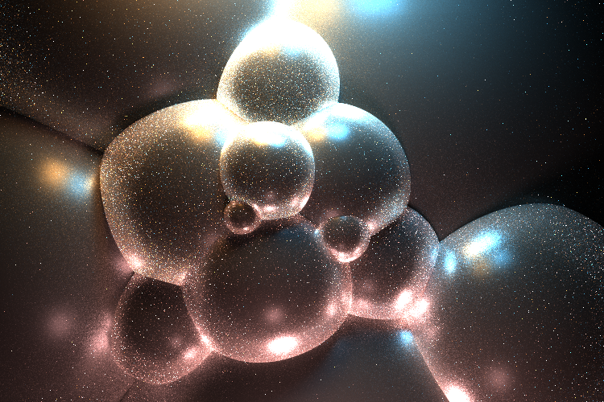

Path Tracer Episode V: Global Illumination Strikes Back
======================

Sarah Forcier
58131867

Comparison
------------
Images rendered with 900 samples per pixel and a recursion depth of 8
#### New Full Lighting

#### Old Full Lighting

#### Direct Lighting

#### Naive

Custom scenes
-----------
Images rendered with 1600 samples per pixel and a recursion depth of 8
#### Bubbles
Description

#### Stairs
description

#### Curved Wall

Extra credit
-----------
#### Oren Nayar (5)
all rendered with 100 samples, 5 recursion, full lighting

Lambertian

 

Sigma = 0.3

 

Sigma = 0.5

#### Lambertian Transmission (5)

#### Fresnel Conductor (8)
see Curved Wall image above with glass and metal materials, where the metal is gold using a Fresnel Conductor and k and eta constants given in PBRT. 